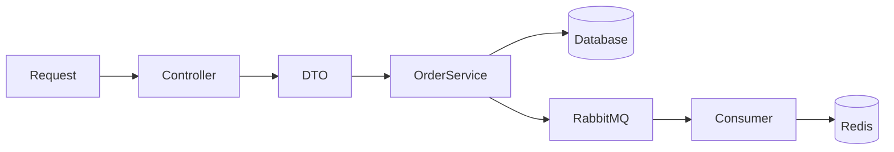

README

## Tech stack
- PHP 8.4
- Symfony 7
- MySql
- RabbitMQ
- Redis
- Docker
- PHPUnit

## Features
- Clean architecture
- Thin controllers
- Async processing with Messenger
- Unit & Functional tests

## Architecture Overview

